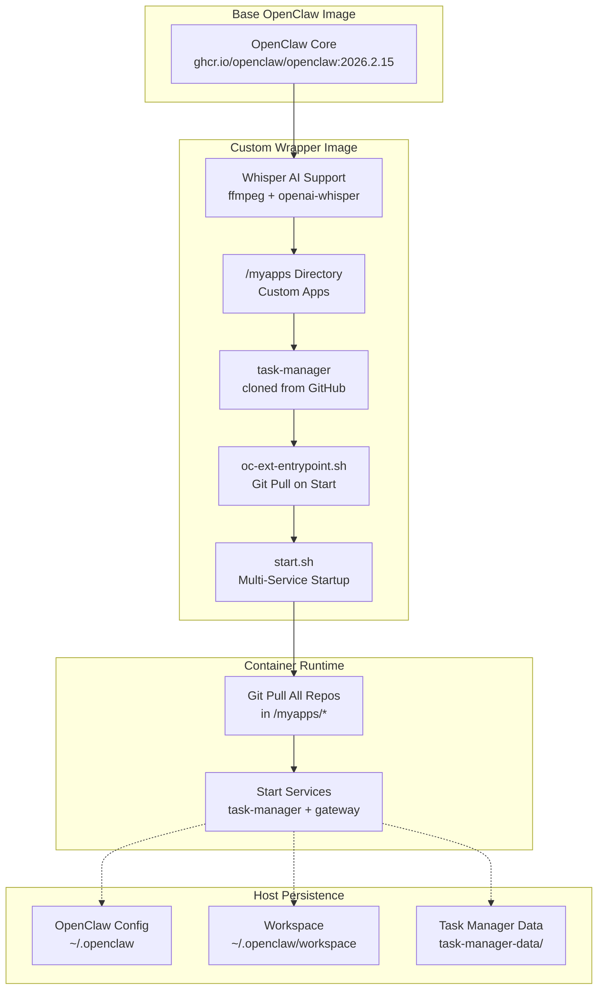
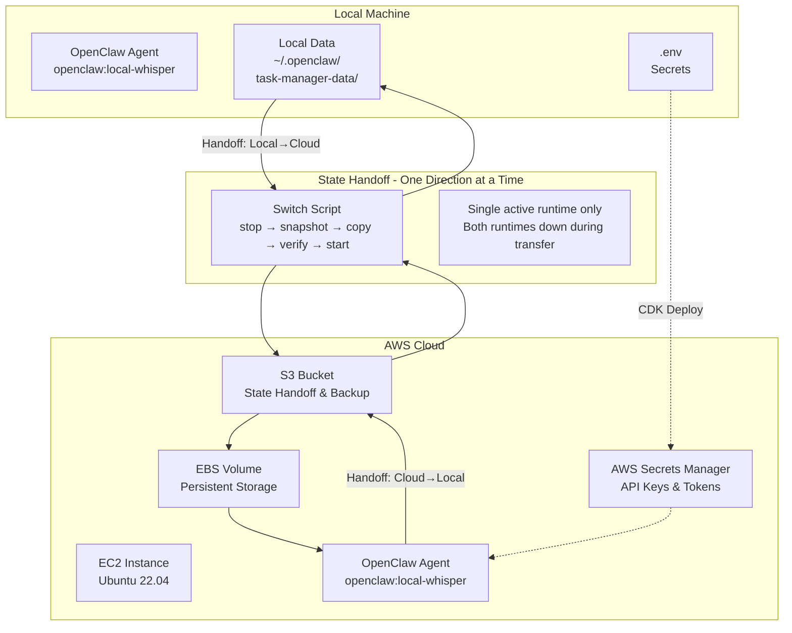
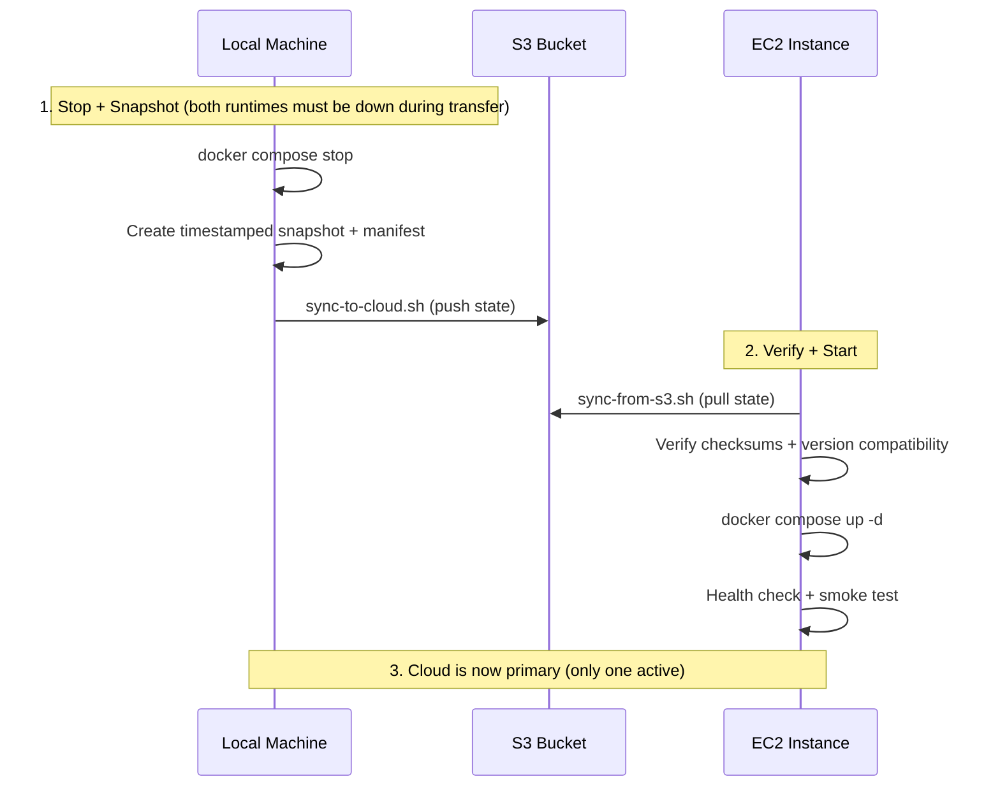
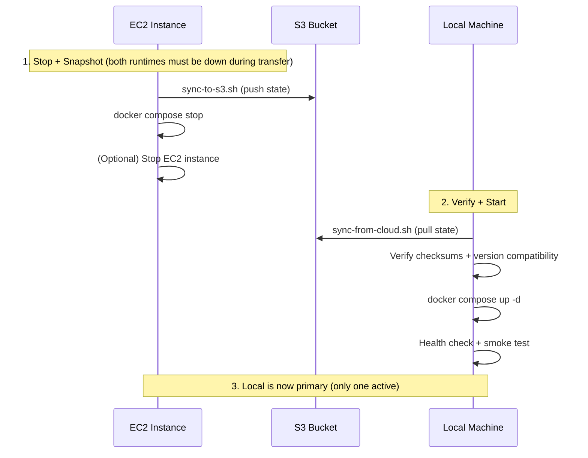
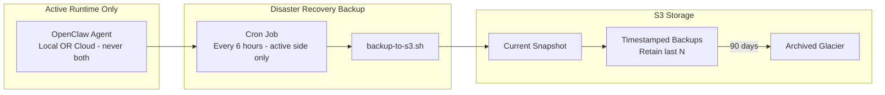
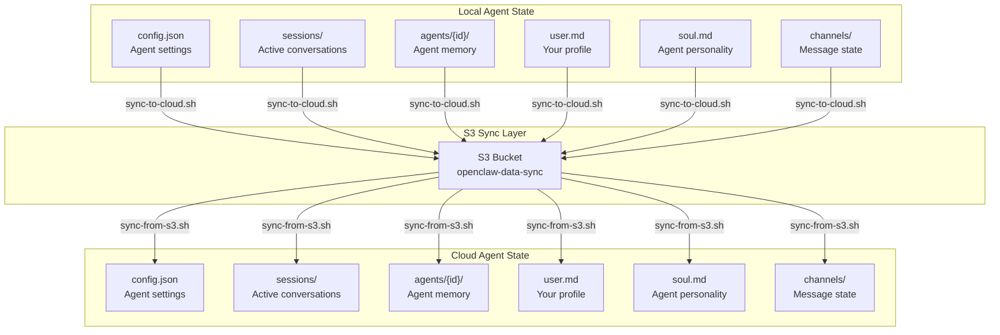

# AI Agent Ecosystem: Architecture Summary & Cloud Migration Plan

## Part 1: Current Architecture Summary

### What We Built: A Flexible AI Agent Deployment Framework

You've created a **wrapper framework on top of standard OpenClaw Docker** that provides a flexible, portable AI agent ecosystem. Here's how it works:

### Architecture Overview



### Key Design Principles

#### 1. **Non-Conflicting Extension Pattern**
- All custom files prefixed with `oc-ext-` or `OC-EXT-`
- Never modifies upstream OpenClaw files
- Can pull latest OpenClaw updates without merge conflicts
- Maintains clean separation: your customizations vs. upstream code

#### 2. **Multi-Repository Architecture**
- **`/app`**: OpenClaw core application (gateway, CLI, agents)
- **`/myapps/*`**: Custom applications as independent git repositories
  - `/myapps/task-manager`: Task management Next.js app
  - Future apps can be added by cloning into `/myapps/`

#### 3. **Git-Pull-On-Start Mechanism (Scoped)**
- Container restart triggers `git pull` for repos in `/myapps/*`
- **On Cloud (built apps, e.g. task-manager)**: `SKIP_BUILD=true` (default) — git pull is informational only; pre-built artifacts from image are used. Runtime does **not** rebuild.
- **On Cloud (script/config-only repos)**: auto-pull at startup is acceptable since there is no build step
- **On Local (development)**: Can use `SKIP_BUILD=false` to rebuild after pulling
- **For code changes that require a rebuild**: rebuild image locally → push to registry → pull on cloud. Do not rely on git pull to update built artifacts at runtime.
- This keeps cloud runtime-only (no build tools needed) and image version = code version for built apps

#### 4. **Multi-Service Orchestration**
- Single container runs multiple services:
  - OpenClaw Gateway (port 18789)
  - Task Manager (port 3847)
  - Future custom apps
- Startup script (`/app/start.sh`) manages service lifecycle

#### 5. **Deployment Flexibility**
The framework is **platform-agnostic**:
- ✅ Local machine (current setup)
- ✅ Cloud VMs (AWS EC2, GCP Compute, Azure VM)
- ✅ Raspberry Pi
- ✅ Any Docker-capable host

### How It Works: Container Lifecycle

1. **Build Time** (`OC-EXT-Dockerfile.local`):
   - Extends base OpenClaw image
   - Installs Whisper AI dependencies
   - Clones custom apps into `/myapps/`
   - Builds all apps
   - Copies custom entrypoint script

2. **Start Time** (`oc-ext-entrypoint.sh`):
   - Loops through `/myapps/*` directories
   - Runs `git pull --ff-only` in each repo (updates code)
   - **On Cloud**: `SKIP_BUILD=true` (default) - uses pre-built artifacts from image
   - **On Local**: Can set `SKIP_BUILD=false` to rebuild after pulling
   - Delegates to `/app/start.sh`

3. **Runtime** (`/app/start.sh`):
   - Starts task-manager in background (binds to 0.0.0.0:3847)
   - Starts OpenClaw gateway (binds to 0.0.0.0:18789)

### Key Files

- [`OC-EXT-Dockerfile.local`](OC-EXT-Dockerfile.local): Main Dockerfile for custom image
- [`oc-ext-entrypoint.sh`](oc-ext-entrypoint.sh): Git-pull-on-start entrypoint
- [`oc-ext-docker-compose.override.yml`](oc-ext-docker-compose.override.yml): Local compose overrides
- [`oc-ext-docker-compose.with-pull.yml`](oc-ext-docker-compose.with-pull.yml): Alternative compose config
- [`.cursorrules`](.cursorrules): Naming convention rules

---

## Part 2: AWS Cloud Migration Plan with State Handoff

### v1 Focus (Three Concerns Only)

The v1 migration plan focuses on exactly three things. Everything else is a future enhancement.

1. **Stop safely** — quiesce the source runtime cleanly, no active writes
2. **Move state safely** — snapshot → copy → verify checksums/file counts
3. **Start safely** — version compatibility check + health/smoke test at destination

Anything beyond these three is explicitly deferred.

---

### Migration Scope

Moving from **local machine** to **AWS EC2** with:
- Infrastructure as Code (AWS CDK)
- **Controlled state handoff** between local and cloud (single active runtime at all times)
- **Scripted switching workflow** with transition window and session continuity guarantees

### Critical Clarification: Development vs Runtime

**IMPORTANT**: This plan assumes:
- **All development happens locally** (coding, building, testing)
- **Cloud is runtime-only** (just runs the agent 24/7 when your local machine is off)

**What this means:**
- ✅ Build Docker image **locally** → push to registry → pull on EC2
- ✅ Develop code **locally** → push to GitHub → cloud auto-pulls on restart
- ✅ Test **locally** before deploying
- ❌ **NO** building on EC2 (no build tools needed)
- ❌ **NO** development on EC2 (no IDE, no git commits from cloud)
- ❌ **NO** full repo clone on EC2 (just docker-compose.yml and oc-ext-* files)

**Workflow:**
1. Develop locally → build image locally → push to registry
2. EC2 pulls image from registry → runs agent
3. Code updates: push to GitHub → restart EC2 → auto-pulls latest (non-built/script repos only)
4. Only rebuild image when adding new apps to `/myapps/`, changing Dockerfile, or changing build output

---

### Operating Model (Hard Constraints — v1 Invariants)

These are top-level invariants, not optional guidelines. The entire switching workflow is designed around these rules.

| Constraint | Rule |
|---|---|
| **Single active runtime** | Never run local and cloud agents simultaneously — ever |
| **Both-down transition window** | State transfer only happens when both runtimes are stopped |
| **Switch only via script** | No manual start/stop sequences during transitions |
| **Abort on uncertainty** | Fail closed; do not continue "best effort" if preflight fails |
| **No conflict merge in v1** | Abort if unexpected destination changes are detected |
| **Handoff-based, not continuous** | State transfer is a one-time copy during the switch, not ongoing sync |

> **State transfer model**: controlled handoff from active runtime → next runtime, never concurrent writers.

---

### Architectural Position Alignment

This section captures the agreed architectural position that the migration plan must stay consistent with.

#### Current Position (Must Remain True)

- **OpenClaw remains upstream and untouched** — the system uses a wrapper/extension layer (`oc-ext-*`, `/myapps`, scripts) and never modifies OpenClaw internals
- **Do not fork OpenClaw now** — stay upstream-compatible; learn from real usage before taking ownership of deeper complexity
- **Extension-only strategy** — all custom logic lives outside OpenClaw internals to preserve upgradeability and future migration flexibility
- **Postpone DB-backed architecture** — remain file-based until real concurrency/workflow pain justifies migration
- **File storage is acceptable for current stage** because of the single-agent + single-writer + local/cloud switching model
- **Fork only on real friction** — trigger points: DB need, multi-agent concurrency, file-system limits, missing lifecycle controls
- **Conceptual model**: Manthan (system vision) uses OpenClaw (runtime engine) — maintain this separation for future evolution
- **Protect future optionality** — avoid tight coupling to internal file structures; keep new logic in the extension layer

#### What This Means for the Migration Plan

- The migration plan must not introduce complexity that creates tight coupling to OpenClaw internals
- No pluggable sync engines, orchestration frameworks, or migration dashboards in v1
- A single script + clear documented process is sufficient
- Mark any beyond-v1 ideas explicitly as **future enhancements**

---

### Architecture: Hybrid Local-Cloud Setup



### Use Cases

1. **Normal Operation**: Use local agent (local machine always on)
   - **Development**: All code changes happen locally
   - **Testing**: Test locally before deploying
   
2. **Vacation Mode**: Sync local → cloud, use cloud agent (local machine off)
   - **Runtime Only**: Cloud runs pre-built image, pulls latest code on restart
   - **No Development**: No coding/building on cloud
   
3. **Return from Vacation**: Sync cloud → local, resume local agent
   - **Development Resumes**: Back to local development
   
4. **Backup**: Continuous sync to S3 for disaster recovery

**Key Principle**: Cloud = Runtime Only. All development, building, and testing happens locally.

### Switch Workflow (v1 Sequence)

Every switch between local and cloud follows this exact sequence. Deviating from it — including manually starting or stopping either side during the transition — is not supported.

```
1. Preflight checks
   ├── Confirm source runtime is fully stopped (no running containers)
   ├── Confirm destination is not running
   ├── Check destination has compatible image/app version
   └── Check disk space / S3 connectivity

2. Graceful stop + quiesce source
   ├── docker compose stop (source)
   ├── Wait for clean shutdown (no active writes)
   └── Delete stale lock files

3. Snapshot / manifest creation
   ├── Record source: image tag, app version, extension versions, timestamp
   ├── Create timestamped archive of state directories
   └── Write manifest file alongside snapshot

4. Copy state to destination (via S3)
   ├── aws s3 sync (source → S3)
   └── aws s3 sync (S3 → destination)

5. Verify checksums / file counts
   ├── Compare file counts and sizes
   ├── Verify manifest matches transferred state
   └── ABORT if mismatch detected — do not start destination

6. Start destination runtime
   ├── Confirm version compatibility (image tag matches manifest)
   └── docker compose up -d (destination)

7. Health check + smoke test
   ├── curl /health endpoint
   ├── Confirm services responding
   └── ABORT + rollback to previous snapshot if health check fails

8. Write active-runtime marker
   └── Record which runtime is now active (local or cloud) + timestamp
```

**Abort behaviour**: at any step, if a check fails, the script exits non-zero, leaves the destination stopped, and preserves the source snapshot for rollback.

**Rollback**: restore previous snapshot (last N retained) and start source again.

### Version Compatibility & Deployment Discipline

#### Image Version = Code Version (Preferred Model)

For built artifacts (Next.js apps, compiled code):
- **Image tag defines the code version** — no runtime code mutation
- Rebuild trigger events: dependency changes, Dockerfile changes, new `/myapps` entries, build output changes
- Primary deployment path: `build locally → push to registry → pull on cloud`

#### Runtime Auto-Pull (Scoped Rule)

- **Built apps** (`task-manager`, Next.js): `SKIP_BUILD=true` on cloud — image already contains build output; git pull at startup is **informational only** (does not rebuild)
- **Script/config repos** (non-built): auto-pull at startup is acceptable
- **Do not mutate built artifacts at runtime** — if new code requires a rebuild, that means a new image build and push cycle, not a runtime git pull

#### Switch Manifest (Required)

Every switch must record a manifest file alongside the snapshot:
```json
{
  "switched_at": "2026-02-21T10:00:00Z",
  "direction": "local-to-cloud",
  "image_tag": "your-registry/openclaw:20260221-abc1234",
  "app_versions": {
    "task-manager": "git-sha-here"
  },
  "extension_versions": {},
  "state_file_count": 142,
  "snapshot_path": "s3://openclaw-data-sync-xxx/backups/2026-02-21-100000/"
}
```

Destination runtime startup is **blocked** if the running image tag does not match the manifest.

### Critical Requirement: Session Continuity

**Goal**: Whether running on local or cloud, it should feel like the **same agent** with full conversation history and context.

**What this means:**
- Agent remembers all previous conversations (local + cloud)
- No "fresh start" feeling when switching environments
- Conversation threads continue seamlessly
- Agent personality and memory (`user.md`, `soul.md`) stay consistent

**How we achieve this:**
- Sync **all** agent state, not just config
- Include session data, conversation history, and active threads
- Sync **before** switching environments (critical!)
- Never run both agents simultaneously (prevents state divergence)

### High-Level Migration Aspects

#### 1. **OpenClaw Configuration** (`~/.openclaw/`)

**What it contains:**
- Agent configurations
- Channel credentials (Telegram, Discord, Slack, etc.)
- Session data
- Gateway tokens
- Provider credentials (Claude AI session keys)

**Migration approach:**
- **Option A (Recommended)**: Volume mount from cloud host filesystem
  - Copy entire `~/.openclaw/` directory to cloud VM
  - Mount as volume: `${OPENCLAW_CONFIG_DIR}:/home/node/.openclaw`
  - Preserves all configurations, sessions, credentials
  
- **Option B**: Docker volume (persistent storage)
  - Create named Docker volume: `docker volume create openclaw-config`
  - Mount: `openclaw-config:/home/node/.openclaw`
  - More portable, survives VM changes
  
**Action items:**
- `rsync` or `scp` local `~/.openclaw/` to cloud VM
- Update `OPENCLAW_CONFIG_DIR` in cloud `.env` file
- Verify file permissions (should be owned by UID 1000, the `node` user in container)

#### 2. **Application Data** (`/myapps/*/data/`)

**What it contains:**
- Task Manager: `tasks.csv`, user data
- Future apps: databases, uploaded files, logs

**Current setup:**
- Volume mount: `${OPENCLAW_CONFIG_DIR}/task-manager-data:/myapps/task-manager/data`

**Migration approach:**
- Copy `task-manager-data/` directory to cloud VM
- Maintain same volume mount pattern
- Consider backup strategy (S3, GCS, Azure Blob)

**Action items:**
- `rsync` local `task-manager-data/` to cloud VM
- Set up automated backups (cron + cloud storage)
- For production: consider managed database (PostgreSQL, MySQL) instead of CSV files

#### 3. **Secrets & Environment Variables** (`.env`)

**What it contains:**
- `OPENCLAW_GATEWAY_TOKEN`: Gateway authentication
- `CLAUDE_AI_SESSION_KEY`: Claude AI provider credentials
- `CLAUDE_WEB_SESSION_KEY`, `CLAUDE_WEB_COOKIE`: Claude web access
- `TWILIO_*`: WhatsApp/SMS credentials (if using Twilio)
- Custom app secrets (API keys, database passwords)

**Migration approach:**
- **DO NOT commit `.env` to git**
- **Option A**: Manually create `.env` on cloud VM
- **Option B**: Use cloud secret management
  - AWS Secrets Manager / Parameter Store
  - GCP Secret Manager
  - Azure Key Vault
  - Pass secrets as environment variables in docker-compose

**Action items:**
- Copy `.env` file to cloud VM (use secure method: `scp` with key auth)
- Rotate sensitive credentials after migration (best practice)
- Set restrictive file permissions: `chmod 600 .env`

#### 4. **Docker Image**

**Important**: All development happens **locally**. Cloud is **runtime-only**.

**Current setup:**
- Image built locally: `openclaw:local-whisper`
- Built from `OC-EXT-Dockerfile.local`

**Migration approach:**
- **Build locally** (where you develop):
  - Build: `docker build -t openclaw:local-whisper -f OC-EXT-Dockerfile.local .`
  - Push to registry: `docker push your-registry/openclaw:local-whisper`
  - Use Docker Hub, GitHub Container Registry, or AWS ECR
  
- **Pull on cloud VM** (runtime only):
  - Pull: `docker pull your-registry/openclaw:local-whisper`
  - No build tools needed on EC2
  - No repo clone needed on EC2 (just pull the image)

**Code updates workflow:**
- Develop locally → Push to GitHub → Cloud agent restarts → Auto-pulls latest code (via `oc-ext-entrypoint.sh`)
- No rebuild needed for code changes (git pull handles it)
- Only rebuild image when adding new apps to `/myapps/` or changing Dockerfile

**Action items:**
- Build image locally and push to registry
- Update `OPENCLAW_IMAGE` in cloud `.env` to use registry image

#### 5. **Network & Firewall Configuration**

**Ports to expose:**
- `18789`: OpenClaw Gateway (main API)
- `18790`: OpenClaw Bridge (optional)
- `3847`: Task Manager web UI

**Security considerations:**
- **IP whitelisting** (as you mentioned):
  - Configure cloud firewall (Security Groups, Firewall Rules)
  - Allow only your IP addresses
  - Example (AWS Security Group):
    - Inbound: TCP 18789, 3847 from `your-ip/32`
- **HTTPS/TLS**: Consider reverse proxy (nginx, Caddy) with Let's Encrypt
- **VPN**: Alternative to IP whitelisting (Tailscale, WireGuard)

**Action items:**
- Configure cloud firewall rules
- Test connectivity from allowed IPs
- (Optional) Set up reverse proxy for HTTPS

#### 6. **Workspace Directory** (`~/.openclaw/workspace/`)

**What it contains:**
- Agent working files
- Temporary data
- Logs

**Migration approach:**
- Usually safe to start fresh on cloud (workspace is transient)
- If you have important data, copy it: `rsync` to cloud VM
- Volume mount: `${OPENCLAW_WORKSPACE_DIR}:/home/node/.openclaw/workspace`

**Action items:**
- Decide: fresh workspace or migrate existing
- Ensure sufficient disk space on cloud VM

#### 7. **Git Repository Access** (for `/myapps/*`)

**Current setup:**
- Public repos: `https://github.com/AbinashGupta/task-manager.git`
- Container pulls on start

**Migration considerations:**
- **Public repos**: No change needed
- **Private repos**: Need authentication
  - SSH keys: Mount `~/.ssh` into container
  - Personal Access Tokens: Use `https://token@github.com/user/repo.git`
  - Deploy keys: Add cloud VM's SSH key to GitHub

**Action items:**
- If using private repos, set up authentication on cloud VM
- Test `git pull` manually before running container

#### 8. **Logging & Monitoring**

**Not strictly required for migration, but recommended:**
- Container logs: `docker logs openclaw-gateway`
- Persistent logs: Mount log directory or use logging driver
- Monitoring: Cloud provider metrics, or tools like Prometheus/Grafana
- Alerts: Notify if services go down

**Action items:**
- Set up log aggregation (optional but useful)
- Configure restart policy: `restart: unless-stopped` (already in compose)

#### 9. **Backup Strategy**

**What to back up:**
- OpenClaw config: `~/.openclaw/`
- App data: `task-manager-data/`
- `.env` file (securely)
- Docker image (or Dockerfile to rebuild)

**Backup approach:**
- Automated daily backups to cloud storage (S3, GCS, etc.)
- Cron job: `rsync` + `aws s3 sync` or `gsutil rsync`
- Version control: Keep `oc-ext-*` files in git (already doing this)

**Action items:**
- Set up automated backups
- Test restore procedure

#### 10. **DNS & Domain (Optional)**

**If you want friendly URLs:**
- Point domain to cloud VM IP
- Example: `openclaw.yourdomain.com` → `3.4.5.6:18789`
- Use reverse proxy (nginx/Caddy) to handle HTTPS

**Action items:**
- (Optional) Configure DNS A record
- (Optional) Set up reverse proxy with SSL

---

## AWS-Specific Infrastructure (CDK)

### Infrastructure Components

#### 1. **EC2 Instance**
- **Instance Type**: `t3.medium` (2 vCPU, 4GB RAM) or `t3.small` for testing
- **AMI**: Ubuntu 22.04 LTS
- **Storage**: 50GB EBS GP3 volume (expandable)
- **Security Group**: 
  - Inbound: SSH (22), OpenClaw Gateway (18789), Task Manager (3847) from your IP(s)
  - Outbound: All traffic (for git pull, npm install, API calls)

#### 2. **S3 Bucket** (State Handoff Transit & Backup)
- **Purpose**: 
  - Intermediate storage for state handoff during controlled switches (not continuous sync)
  - Timestamped snapshots for rollback (retain last N)
  - Version history for disaster recovery
- **Structure**:
  ```
  s3://openclaw-data-sync-{account-id}/
  ├── openclaw-config/          # ~/.openclaw/ contents
  │   ├── config.json
  │   ├── sessions/
  │   ├── agents/
  │   └── ...
  ├── task-manager-data/        # task-manager data
  │   ├── tasks.csv
  │   └── ...
  └── backups/                  # Timestamped backups
      ├── 2026-02-20/
      └── ...
  ```
- **Versioning**: Enabled (keep last 30 days)
- **Lifecycle**: Archive to Glacier after 90 days

#### 3. **AWS Secrets Manager**
- **Purpose**: Store sensitive credentials securely
- **Secrets to store**:
  - `openclaw/gateway-token`: `OPENCLAW_GATEWAY_TOKEN`
  - `openclaw/claude-ai`: `CLAUDE_AI_SESSION_KEY`
  - `openclaw/claude-web`: `CLAUDE_WEB_SESSION_KEY`, `CLAUDE_WEB_COOKIE`
  - `openclaw/twilio`: `TWILIO_ACCOUNT_SID`, `TWILIO_AUTH_TOKEN`, `TWILIO_WHATSAPP_FROM`
  - Custom app secrets
- **Access**: EC2 instance role with read-only access
- **Rotation**: Manual (update when credentials change)

#### 4. **IAM Roles & Policies**
- **EC2 Instance Role**: `OpenClawEC2Role`
  - `SecretsManagerReadOnly`: Read secrets
  - `S3SyncPolicy`: Read/write to sync bucket
  - `CloudWatchLogsPolicy`: Send logs to CloudWatch (optional)

#### 5. **Elastic IP** (Optional but Recommended)
- **Purpose**: Static IP for EC2 instance
- **Benefit**: IP doesn't change on instance restart
- **Cost**: Free when attached to running instance

#### 6. **CloudWatch Logs** (Optional)
- **Purpose**: Centralized logging
- **Log Groups**:
  - `/openclaw/gateway`: Gateway logs
  - `/openclaw/task-manager`: Task manager logs
- **Retention**: 7 days (configurable)

### CDK Stack Structure

```
openclaw-infra/
├── bin/
│   └── openclaw-infra.ts          # CDK app entry point
├── lib/
│   ├── openclaw-stack.ts          # Main stack
│   ├── constructs/
│   │   ├── ec2-instance.ts        # EC2 + security group
│   │   ├── s3-sync-bucket.ts      # S3 bucket for sync
│   │   └── secrets.ts             # Secrets Manager
│   └── config/
│       └── config.ts              # Environment-specific config
├── scripts/
│   ├── sync-to-cloud.sh           # Local → Cloud sync
│   ├── sync-from-cloud.sh         # Cloud → Local sync
│   └── deploy-agent.sh            # Deploy Docker container on EC2
├── cdk.json
├── package.json
└── README.md
```

### Sample CDK Stack (TypeScript)

**`lib/openclaw-stack.ts`:**
```typescript
import * as cdk from 'aws-cdk-lib';
import * as ec2 from 'aws-cdk-lib/aws-ec2';
import * as s3 from 'aws-cdk-lib/aws-s3';
import * as iam from 'aws-cdk-lib/aws-iam';
import * as secretsmanager from 'aws-cdk-lib/aws-secretsmanager';
import { Construct } from 'constructs';

export class OpenClawStack extends cdk.Stack {
  constructor(scope: Construct, id: string, props?: cdk.StackProps) {
    super(scope, id, props);

    // 1. Create VPC (or use default)
    const vpc = ec2.Vpc.fromLookup(this, 'DefaultVPC', { isDefault: true });

    // 2. Create S3 bucket for data sync
    const syncBucket = new s3.Bucket(this, 'OpenClawSyncBucket', {
      bucketName: `openclaw-data-sync-${this.account}`,
      versioned: true,
      lifecycleRules: [
        {
          id: 'ArchiveOldBackups',
          prefix: 'backups/',
          transitions: [
            {
              storageClass: s3.StorageClass.GLACIER,
              transitionAfter: cdk.Duration.days(90),
            },
          ],
        },
      ],
      removalPolicy: cdk.RemovalPolicy.RETAIN, // Don't delete on stack destroy
    });

    // 3. Create IAM role for EC2
    const ec2Role = new iam.Role(this, 'OpenClawEC2Role', {
      assumedBy: new iam.ServicePrincipal('ec2.amazonaws.com'),
      managedPolicies: [
        iam.ManagedPolicy.fromAwsManagedPolicyName('AmazonSSMManagedInstanceCore'), // For Systems Manager
      ],
    });

    // Grant S3 access
    syncBucket.grantReadWrite(ec2Role);

    // Grant Secrets Manager read access
    ec2Role.addToPolicy(
      new iam.PolicyStatement({
        actions: ['secretsmanager:GetSecretValue'],
        resources: [`arn:aws:secretsmanager:${this.region}:${this.account}:secret:openclaw/*`],
      })
    );

    // 4. Create security group
    const securityGroup = new ec2.SecurityGroup(this, 'OpenClawSecurityGroup', {
      vpc,
      description: 'Security group for OpenClaw EC2 instance',
      allowAllOutbound: true,
    });

    // Add your IP (replace with actual IP or use CDK context)
    const myIp = this.node.tryGetContext('myIp') || '0.0.0.0/0'; // WARNING: 0.0.0.0/0 is insecure, use your actual IP
    securityGroup.addIngressRule(ec2.Peer.ipv4(myIp), ec2.Port.tcp(22), 'SSH access');
    securityGroup.addIngressRule(ec2.Peer.ipv4(myIp), ec2.Port.tcp(18789), 'OpenClaw Gateway');
    securityGroup.addIngressRule(ec2.Peer.ipv4(myIp), ec2.Port.tcp(3847), 'Task Manager');

    // 5. Create EC2 key pair (manual step: create in AWS console or use existing)
    // For automation, you can use aws-cdk-lib/aws-ec2.KeyPair (CDK v2.80+)

    // 6. Create EC2 instance
    const instance = new ec2.Instance(this, 'OpenClawInstance', {
      vpc,
      instanceType: ec2.InstanceType.of(ec2.InstanceClass.T3, ec2.InstanceSize.MEDIUM),
      machineImage: ec2.MachineImage.lookup({
        name: 'ubuntu/images/hvm-ssd/ubuntu-jammy-22.04-amd64-server-*',
        owners: ['099720109477'], // Canonical
      }),
      securityGroup,
      role: ec2Role,
      keyName: this.node.tryGetContext('keyPairName') || 'openclaw-ec2-key', // Must exist in AWS
      blockDevices: [
        {
          deviceName: '/dev/sda1',
          volume: ec2.BlockDeviceVolume.ebs(50, {
            volumeType: ec2.EbsDeviceVolumeType.GP3,
          }),
        },
      ],
      userData: ec2.UserData.forLinux(),
    });

    // User data script (runs on first boot)
    // Note: Only installs runtime tools (Docker, AWS CLI, git for code pulls)
    // NO build tools (npm/node) - image is built locally and pulled from registry
    instance.userData.addCommands(
      '#!/bin/bash',
      'set -e',
      'apt-get update',
      'apt-get install -y docker.io docker-compose awscli git',
      'usermod -aG docker ubuntu',
      'systemctl enable docker',
      'systemctl start docker',
      'mkdir -p /opt/openclaw',
      'chown ubuntu:ubuntu /opt/openclaw',
    );

    // 7. Allocate Elastic IP (optional but recommended)
    const eip = new ec2.CfnEIP(this, 'OpenClawEIP', {
      instanceId: instance.instanceId,
    });

    // 8. Outputs
    new cdk.CfnOutput(this, 'InstanceId', {
      value: instance.instanceId,
      description: 'EC2 Instance ID',
    });

    new cdk.CfnOutput(this, 'PublicIP', {
      value: eip.ref,
      description: 'EC2 Public IP (Elastic IP)',
    });

    new cdk.CfnOutput(this, 'S3BucketName', {
      value: syncBucket.bucketName,
      description: 'S3 Bucket for data sync',
    });

    new cdk.CfnOutput(this, 'SSHCommand', {
      value: `ssh -i ~/.ssh/openclaw-ec2-key.pem ubuntu@${eip.ref}`,
      description: 'SSH command to connect to EC2',
    });
  }
}
```

**`bin/openclaw-infra.ts`:**
```typescript
#!/usr/bin/env node
import 'source-map-support/register';
import * as cdk from 'aws-cdk-lib';
import { OpenClawStack } from '../lib/openclaw-stack';

const app = new cdk.App();

new OpenClawStack(app, 'OpenClawStack', {
  env: {
    account: process.env.CDK_DEFAULT_ACCOUNT,
    region: process.env.CDK_DEFAULT_REGION || 'us-east-1',
  },
  description: 'OpenClaw AI Agent Infrastructure (EC2, S3, Secrets Manager)',
});
```

**`cdk.json`:**
```json
{
  "app": "npx ts-node --prefer-ts-exts bin/openclaw-infra.ts",
  "context": {
    "myIp": "YOUR_IP_HERE/32",
    "keyPairName": "openclaw-ec2-key"
  }
}
```

### CDK Deployment

**Prerequisites:**
```bash
npm install -g aws-cdk
cdk bootstrap aws://ACCOUNT-ID/REGION
```

**Deploy infrastructure:**
```bash
cd openclaw-infra
npm install
cdk synth  # Preview CloudFormation template
cdk deploy OpenClawStack --context myIp="YOUR_IP/32"
```

**CDK will output:**
- EC2 instance ID
- EC2 public IP (Elastic IP)
- S3 bucket name
- SSH command

**Example output:**
```
Outputs:
OpenClawStack.InstanceId = i-0123456789abcdef0
OpenClawStack.PublicIP = 54.123.45.67
OpenClawStack.S3BucketName = openclaw-data-sync-123456789012
OpenClawStack.SSHCommand = ssh -i ~/.ssh/openclaw-ec2-key.pem ubuntu@54.123.45.67
```

---

## State Handoff & Transfer Strategy

> **Framing note**: This is not a general bidirectional sync system. It is a controlled, scripted, one-direction-at-a-time state handoff between runtimes. There is no conflict resolution, no concurrent writers, and no always-on sync. The sequence is: stop source → copy state → verify → start destination.

### Handoff Data Architecture

**Data to transfer for session continuity:**

1. **OpenClaw Config** (`~/.openclaw/`)
   - `config.json`: Agent configurations, channel settings
   - `sessions/`: **CRITICAL** - Active session data, conversation state
   - `agents/{agent-id}/`: **CRITICAL** - Agent-specific data
     - `user.md`: User profile, preferences, context about you
     - `soul.md`: Agent personality, instructions, behavior
     - `sessions/`: Agent's conversation history and memory
     - `memory/`: Long-term memory, facts learned about you
     - `context/`: Conversation context, active threads
   - `credentials/`: Provider credentials (Claude, etc.)
   - `channels/`: Channel state (last message IDs, webhook tokens)
   - `workspace/`: Working files (optional, can be transient)

2. **Application Data** (`task-manager-data/`)
   - `tasks.csv`: Task list
   - User uploads, databases, etc.

3. **Secrets** (`.env`)
   - Managed via AWS Secrets Manager (not synced via S3)

**Why session data is critical:**
- Without syncing `sessions/`, the agent won't remember your conversations
- Without syncing `user.md`/`soul.md`, the agent loses its personality and context about you
- Without syncing `channels/`, you might get duplicate messages or miss messages
- Result: Feels like talking to a different agent ❌

**With full sync:**
- Agent remembers everything from local when running on cloud ✅
- Conversations continue seamlessly ✅
- Same personality, same context, same memory ✅
- Result: Feels like the same agent, just running elsewhere ✅

### Transfer Methods

#### Method 1: Switch Scripts via S3 (v1 — Recommended)

**Local → Cloud (Before Vacation)**
```bash
#!/bin/bash
# scripts/sync-to-cloud.sh
# Syncs ALL agent state to S3 for session continuity

set -e

BUCKET_NAME="openclaw-data-sync-123456789"
LOCAL_CONFIG="$HOME/.openclaw"
LOCAL_TASK_DATA="$HOME/.openclaw/task-manager-data"  # Adjust path

echo "=========================================="
echo "Syncing local OpenClaw agent to cloud..."
echo "=========================================="

# IMPORTANT: Stop local agent first to ensure clean state
echo "Checking if local OpenClaw is running..."
if docker ps | grep -q openclaw-gateway; then
  echo "WARNING: Local OpenClaw is still running!"
  echo "Please stop it first: docker compose stop openclaw-gateway"
  read -p "Stop now? (y/n) " -n 1 -r
  echo
  if [[ $REPLY =~ ^[Yy]$ ]]; then
    docker compose stop openclaw-gateway
    echo "Stopped local OpenClaw."
    sleep 2  # Give it time to flush state
  else
    echo "Aborting sync. Stop OpenClaw and try again."
    exit 1
  fi
fi

echo ""
echo "Syncing OpenClaw config (including sessions, agents, memory)..."
# Sync ALL config including sessions for continuity
aws s3 sync "$LOCAL_CONFIG" "s3://$BUCKET_NAME/openclaw-config/" \
  --exclude "workspace/*" \
  --exclude "*.log" \
  --exclude "*.tmp" \
  --delete

echo ""
echo "Syncing task-manager data..."
aws s3 sync "$LOCAL_TASK_DATA" "s3://$BUCKET_NAME/task-manager-data/" \
  --delete

# Create timestamped backup for safety
TIMESTAMP=$(date +%Y-%m-%d-%H%M%S)
echo ""
echo "Creating timestamped backup: $TIMESTAMP"
aws s3 sync "$LOCAL_CONFIG" "s3://$BUCKET_NAME/backups/$TIMESTAMP/openclaw-config/" \
  --exclude "workspace/*" \
  --exclude "*.log"

echo ""
echo "=========================================="
echo "Sync complete! ✓"
echo "=========================================="
echo ""
echo "Data synced to S3:"
echo "  - Agent config, sessions, memory"
echo "  - User.md, soul.md (agent personality)"
echo "  - Channel state, credentials"
echo "  - Task manager data"
echo ""
echo "Next steps:"
echo "  1. SSH to EC2: ssh -i ~/.ssh/openclaw-ec2-key.pem ubuntu@ec2-ip"
echo "  2. Pull data: sudo /opt/openclaw/scripts/sync-from-s3.sh"
echo "  3. Start agent: cd /opt/openclaw && docker compose up -d"
echo "  4. Verify: docker logs openclaw-gateway"
echo ""
echo "Agent will remember all conversations and context! ✓"
echo "=========================================="
```

**Cloud → Local (After Vacation)**
```bash
#!/bin/bash
# scripts/sync-from-cloud.sh
# Restores ALL agent state from S3 for session continuity

set -e

BUCKET_NAME="openclaw-data-sync-123456789"
LOCAL_CONFIG="$HOME/.openclaw"
LOCAL_TASK_DATA="$HOME/.openclaw/task-manager-data"

echo "=========================================="
echo "Syncing cloud OpenClaw agent to local..."
echo "=========================================="

# IMPORTANT: Stop local agent first if running
echo "Checking if local OpenClaw is running..."
if docker ps | grep -q openclaw-gateway; then
  echo "Stopping local OpenClaw..."
  docker compose stop openclaw-gateway
  sleep 2
fi

# Backup local data first (safety)
TIMESTAMP=$(date +%Y-%m-%d-%H%M%S)
echo ""
echo "Creating local backup: $LOCAL_CONFIG.backup.$TIMESTAMP"
if [ -d "$LOCAL_CONFIG" ]; then
  cp -r "$LOCAL_CONFIG" "$LOCAL_CONFIG.backup.$TIMESTAMP"
fi

echo ""
echo "Pulling OpenClaw config from S3 (including sessions, agents, memory)..."
# Sync ALL config including sessions for continuity
aws s3 sync "s3://$BUCKET_NAME/openclaw-config/" "$LOCAL_CONFIG" \
  --exclude "workspace/*" \
  --exclude "*.log" \
  --delete

echo ""
echo "Pulling task-manager data from S3..."
aws s3 sync "s3://$BUCKET_NAME/task-manager-data/" "$LOCAL_TASK_DATA" \
  --delete

echo ""
echo "=========================================="
echo "Sync complete! ✓"
echo "=========================================="
echo ""
echo "Data restored from cloud:"
echo "  - Agent config, sessions, memory"
echo "  - User.md, soul.md (agent personality)"
echo "  - Channel state, credentials"
echo "  - Task manager data"
echo ""
echo "Next steps:"
echo "  1. Start local agent: docker compose up -d"
echo "  2. Verify: docker logs openclaw-gateway"
echo "  3. Test: Send a message via your channel"
echo ""
echo "Agent will remember all cloud conversations! ✓"
echo "=========================================="
```

**On EC2: Sync from S3 to EC2**
```bash
#!/bin/bash
# /opt/openclaw/scripts/sync-from-s3.sh (runs on EC2)

set -e

BUCKET_NAME="openclaw-data-sync-123456789"
EC2_CONFIG="/home/ubuntu/openclaw-config"
EC2_TASK_DATA="/home/ubuntu/task-manager-data"

echo "Syncing data from S3 to EC2..."

# Sync from S3 (includes sessions, agents, memory, credentials, identity)
aws s3 sync "s3://$BUCKET_NAME/openclaw-config/" "$EC2_CONFIG" \
  --exclude "workspace/*" \
  --exclude "*.log" \
  --delete

aws s3 sync "s3://$BUCKET_NAME/task-manager-data/" "$EC2_TASK_DATA" \
  --delete

# Clean stale lock files from the source environment
find "$EC2_CONFIG" -name "*.lock" -delete 2>/dev/null || true

# Fix permissions (container runs as UID 1000)
sudo chown -R 1000:1000 "$EC2_CONFIG" "$EC2_TASK_DATA"

echo "Sync complete! Restart OpenClaw: docker compose restart openclaw-gateway"
```

**On EC2: Sync from EC2 to S3**
```bash
#!/bin/bash
# /opt/openclaw/scripts/sync-to-s3.sh (runs on EC2)

set -e

BUCKET_NAME="openclaw-data-sync-123456789"
EC2_CONFIG="/home/ubuntu/openclaw-config"
EC2_TASK_DATA="/home/ubuntu/task-manager-data"

echo "Syncing EC2 data to S3..."

# Sync ALL agent state (sessions, memory, credentials, identity)
aws s3 sync "$EC2_CONFIG" "s3://$BUCKET_NAME/openclaw-config/" \
  --exclude "workspace/*" \
  --exclude "*.log" \
  --exclude "*.lock" \
  --exclude "*.tmp" \
  --delete

aws s3 sync "$EC2_TASK_DATA" "s3://$BUCKET_NAME/task-manager-data/" \
  --delete

# Create timestamped backup
TIMESTAMP=$(date +%Y-%m-%d-%H%M%S)
aws s3 sync "$EC2_CONFIG" "s3://$BUCKET_NAME/backups/$TIMESTAMP/openclaw-config/" \
  --exclude "workspace/*" \
  --exclude "*.log" \
  --exclude "*.lock"

echo "Sync complete! Data backed up to S3."
```

#### Method 2: Automated / Continuous Approaches (Future Enhancement — Not v1)

> **Deferred**: These approaches introduce always-on sync complexity that is not needed at this stage. The single active runtime model makes continuous sync unnecessary — state is only transferred during a controlled switch. Revisit if real operational pain justifies it.

**Deferred options (do not build yet):**
- Cron-based periodic backup to S3 (only while primary runtime is active — safe as a pure backup, not a sync)
- S3 Event Notifications + Lambda for real-time propagation
- AWS DataSync managed service

**What IS acceptable in v1**: a cron job on the active side that creates a periodic **backup snapshot** to S3 for disaster recovery purposes only (not for switching).

### Switch Workflow Examples

#### Scenario 1: Switch to Cloud (Local → Cloud)

```bash
# 1. On local machine: Push latest data to S3
./scripts/sync-to-cloud.sh

# 2. SSH to EC2
ssh -i ~/.ssh/openclaw-ec2.pem ubuntu@ec2-ip

# 3. On EC2: Pull data from S3
sudo /opt/openclaw/scripts/sync-from-s3.sh

# 4. On EC2: Restart OpenClaw
cd /opt/openclaw
docker compose restart openclaw-gateway

# 5. Verify services are running
docker logs openclaw-gateway
curl http://localhost:18789/health

# 6. On local machine: Stop local OpenClaw
docker compose stop openclaw-gateway

# Done! Now using cloud agent
```

#### Scenario 2: Switch to Local (Cloud → Local)

```bash
# 1. SSH to EC2: Push latest data to S3
ssh -i ~/.ssh/openclaw-ec2.pem ubuntu@ec2-ip
sudo /opt/openclaw/scripts/sync-to-s3.sh
exit

# 2. On local machine: Pull data from S3
./scripts/sync-from-cloud.sh

# 3. On local machine: Restart OpenClaw
docker compose restart openclaw-gateway

# 4. Verify services are running
docker logs openclaw-gateway
curl http://localhost:18789/health

# 5. (Optional) Stop EC2 instance to save costs
aws ec2 stop-instances --instance-ids i-1234567890abcdef0

# Done! Now using local agent
```

#### Scenario 3: Emergency Handoff (Cloud While Local Must Stop)

```bash
# 1. On local machine: Push latest data to S3
./scripts/sync-to-cloud.sh

# 2. SSH to EC2: Pull data from S3
ssh -i ~/.ssh/openclaw-ec2.pem ubuntu@ec2-ip
sudo /opt/openclaw/scripts/sync-from-s3.sh
docker compose restart openclaw-gateway

# 3. IMPORTANT: Stop local agent to avoid conflicts
# (On local machine)
docker compose stop openclaw-gateway

# 4. Use cloud agent temporarily

# 5. When done, sync back:
# On EC2: sudo /opt/openclaw/scripts/sync-to-s3.sh
# On local: ./scripts/sync-from-cloud.sh
# On local: docker compose start openclaw-gateway
```

### Ensuring Session Continuity

**Top-level invariant**: **NEVER run both agents simultaneously — this is a hard constraint, not a guideline.**

Running local and cloud agents at the same time violates the single-writer assumption and will cause:
- ❌ Divergent conversation histories
- ❌ Duplicate message processing
- ❌ Conflicting state updates
- ❌ Agent "forgetting" conversations from the other environment
- ❌ Potential data corruption

The switch script enforces this: it will not start the destination runtime unless it can confirm the source is stopped.

**Correct workflow (enforced by script):**
1. ✅ Stop source agent (source must be fully stopped before transfer begins)
2. ✅ Snapshot + transfer state → S3 → destination
3. ✅ Verify checksums / file counts
4. ✅ Start destination agent
5. ✅ Health check passes → switch is complete
6. ✅ When switching back, reverse the process with same guarantees

**Session continuity checklist:**
- [ ] Synced `~/.openclaw/sessions/` (active conversations)
- [ ] Synced `~/.openclaw/agents/{agent-id}/sessions/` (agent memory)
- [ ] Synced `user.md` and `soul.md` (agent personality)
- [ ] Synced `channels/` state (last message IDs)
- [ ] Only ONE agent running at a time
- [ ] Tested: Agent remembers previous conversations

**How to verify session continuity:**
```bash
# After switching to cloud, test with a message that references past context
# Example: "What did we discuss yesterday about the project?"
# Agent should remember and respond correctly

# Check session files are present
ls -la ~/.openclaw/agents/*/sessions/
ls -la ~/.openclaw/sessions/

# Check last modified times (should be recent after sync)
find ~/.openclaw -name "*.jsonl" -mtime -1
```

### Conflict Handling (v1 Model: Abort, Not Merge)

**v1 design principle**: there are no concurrent writers, so conflicts should not occur. If the switch script detects unexpected changes on the destination (i.e., files modified after the last known switch), it **aborts** rather than attempting to merge.

**Why abort instead of merge:**
- The single-active-runtime invariant means legitimate conflicts cannot happen in normal operation
- If a conflict IS detected, it means a procedure violation occurred (both agents ran simultaneously, or a manual change was made)
- Merging in this situation risks silently losing data — aborting forces a conscious decision

**v1 conflict response:**
1. Script detects unexpected destination changes → exits with error, destination stays stopped
2. Operator reviews what changed on destination
3. Operator manually decides: keep source state or destination state (not both)
4. Restore from the chosen snapshot and proceed

**No conflict merge logic will be built in v1.** If merge tooling becomes necessary, that is a future enhancement triggered by real operational need.

**If both agents were accidentally run simultaneously:**
1. Stop both agents immediately
2. Do NOT attempt to merge — treat the destination state as corrupted
3. Identify which environment has the most recent valid state
4. Restore only from that environment's snapshot
5. Review conversation history for gaps manually if needed

### Switch Checklist

**Before switching to cloud:**
- [ ] Commit any local changes to git (for `oc-ext-*` files)
- [ ] Run `sync-to-cloud.sh` to push data to S3
- [ ] Verify S3 upload completed successfully
- [ ] SSH to EC2 and run `sync-from-s3.sh`
- [ ] Restart cloud OpenClaw: `docker compose restart`
- [ ] Test cloud agent (send test message)
- [ ] Stop local OpenClaw: `docker compose stop`

**Before switching to local:**
- [ ] SSH to EC2 and run `sync-to-s3.sh`
- [ ] Verify S3 upload completed successfully
- [ ] Run `sync-from-cloud.sh` on local machine
- [ ] Restart local OpenClaw: `docker compose restart`
- [ ] Test local agent (send test message)
- [ ] (Optional) Stop EC2 instance: `aws ec2 stop-instances`

---

## AWS Migration Checklist (CDK-Based)

### Phase 1: Local Preparation

**Note**: All development happens locally. Cloud is runtime-only.

- [ ] **Verify current local setup works**
  ```bash
  docker compose up -d
  docker logs openclaw-gateway
  curl http://localhost:18789/health
  ```

- [ ] **Build Docker image locally** (where you develop)
  ```bash
  # On local machine
  cd /path/to/openclaw
  docker build -t your-dockerhub-username/openclaw:local-whisper -f OC-EXT-Dockerfile.local .
  
  # Push to registry (Docker Hub, GitHub Container Registry, or AWS ECR)
  docker push your-dockerhub-username/openclaw:local-whisper
  
  # Note: This image will be pulled on EC2 - no building on cloud!
  ```

- [ ] **Install AWS CLI and CDK**
  ```bash
  # Install AWS CLI
  curl "https://awscli.amazonaws.com/awscli-exe-linux-x86_64.zip" -o "awscliv2.zip"
  unzip awscliv2.zip
  sudo ./aws/install
  
  # Configure AWS credentials
  aws configure
  # Enter: Access Key ID, Secret Access Key, Region (e.g., us-east-1)
  
  # Install CDK
  npm install -g aws-cdk
  cdk --version
  ```

- [ ] **Bootstrap CDK (one-time per account/region)**
  ```bash
  cdk bootstrap aws://ACCOUNT-ID/us-east-1
  ```

- [ ] **Create CDK project**
  ```bash
  mkdir openclaw-infra
  cd openclaw-infra
  cdk init app --language typescript
  npm install @aws-cdk/aws-ec2 @aws-cdk/aws-s3 @aws-cdk/aws-secretsmanager @aws-cdk/aws-iam
  ```

- [ ] **Backup local data (safety first)**
  ```bash
  # Create local backup
  tar -czf openclaw-backup-$(date +%Y%m%d).tar.gz ~/.openclaw/ ~/path/to/task-manager-data/
  
  # Store backup somewhere safe
  cp openclaw-backup-*.tar.gz /path/to/external/drive/
  ```

### Phase 2: AWS Infrastructure Setup (CDK)

- [ ] **Create CDK stack** (see CDK Stack Structure section above)
  - Define EC2 instance with security group
  - Create S3 bucket for data sync
  - Set up Secrets Manager for credentials
  - Configure IAM roles and policies
  - (Optional) Allocate Elastic IP

- [ ] **Deploy CDK stack**
  ```bash
  cd openclaw-infra
  cdk synth  # Preview CloudFormation template
  cdk deploy OpenClawStack
  ```

- [ ] **Note CDK outputs**
  - EC2 Public IP: `ec2-xx-xx-xx-xx.compute-1.amazonaws.com`
  - S3 Bucket Name: `openclaw-data-sync-123456789`
  - Secrets Manager ARNs

- [ ] **Store secrets in AWS Secrets Manager**
  ```bash
  # From local .env file, create secrets
  aws secretsmanager create-secret \
    --name openclaw/gateway-token \
    --secret-string "your-gateway-token-here"
  
  aws secretsmanager create-secret \
    --name openclaw/claude-ai \
    --secret-string '{"session_key":"your-key-here"}'
  
  # Repeat for all secrets
  ```

- [ ] **Update EC2 security group with your IP**
  ```bash
  MY_IP=$(curl -s https://checkip.amazonaws.com)
  aws ec2 authorize-security-group-ingress \
    --group-id sg-xxxxxxxxx \
    --protocol tcp --port 22 --cidr $MY_IP/32
  
  aws ec2 authorize-security-group-ingress \
    --group-id sg-xxxxxxxxx \
    --protocol tcp --port 18789 --cidr $MY_IP/32
  
  aws ec2 authorize-security-group-ingress \
    --group-id sg-xxxxxxxxx \
    --protocol tcp --port 3847 --cidr $MY_IP/32
  ```

### Phase 3: EC2 Instance Setup

- [ ] **SSH to EC2 instance**
  ```bash
  # Download SSH key from CDK output or AWS console
  chmod 400 openclaw-ec2-key.pem
  ssh -i openclaw-ec2-key.pem ubuntu@ec2-public-ip
  ```

- [ ] **Install Docker and Docker Compose on EC2**
  ```bash
  # On EC2
  curl -fsSL https://get.docker.com | sh
  sudo usermod -aG docker ubuntu
  
  # Install Docker Compose
  sudo curl -L "https://github.com/docker/compose/releases/latest/download/docker-compose-$(uname -s)-$(uname -m)" -o /usr/local/bin/docker-compose
  sudo chmod +x /usr/local/bin/docker-compose
  
  # Logout and login again for group changes
  exit
  ssh -i openclaw-ec2-key.pem ubuntu@ec2-public-ip
  
  # Verify
  docker --version
  docker-compose --version
  ```

- [ ] **Install AWS CLI on EC2** (for S3 sync)
  ```bash
  # On EC2
  sudo apt update
  sudo apt install -y awscli
  aws --version
  
  # AWS credentials are auto-configured via IAM instance role (no manual config needed)
  ```

- [ ] **Pull Docker image from registry** (NOT building on EC2)
  ```bash
  # On EC2
  # First, build and push image from LOCAL machine:
  # (On local machine)
  docker build -t your-dockerhub-username/openclaw:local-whisper -f OC-EXT-Dockerfile.local .
  docker push your-dockerhub-username/openclaw:local-whisper
  
  # Then pull on EC2:
  # (On EC2)
  docker pull your-dockerhub-username/openclaw:local-whisper
  docker tag your-dockerhub-username/openclaw:local-whisper openclaw:local-whisper
  ```

- [ ] **Create minimal OpenClaw directory on EC2** (for docker-compose.yml only)
  ```bash
  # On EC2
  mkdir -p /opt/openclaw
  cd /opt/openclaw
  
  # Clone ONLY to get docker-compose.yml and oc-ext-* files
  # (We don't need the full repo, just compose configs)
  git clone --depth 1 https://github.com/openclaw/openclaw.git /tmp/openclaw-temp
  cp /tmp/openclaw-temp/docker-compose.yml .
  cp /tmp/openclaw-temp/oc-ext-*.yml .
  cp /tmp/openclaw-temp/oc-ext-*.sh .
  rm -rf /tmp/openclaw-temp
  sudo chown -R ubuntu:ubuntu /opt/openclaw
  ```

- [ ] **Create sync scripts on EC2**
  ```bash
  # On EC2
  mkdir -p /opt/openclaw/scripts
  
  # Create sync-from-s3.sh (see script in Data Sync section)
  nano /opt/openclaw/scripts/sync-from-s3.sh
  chmod +x /opt/openclaw/scripts/sync-from-s3.sh
  
  # Create sync-to-s3.sh
  nano /opt/openclaw/scripts/sync-to-s3.sh
  chmod +x /opt/openclaw/scripts/sync-to-s3.sh
  ```

- [ ] **Create directories for data on EC2**
  ```bash
  # On EC2
  mkdir -p /home/ubuntu/openclaw-config
  mkdir -p /home/ubuntu/task-manager-data
  sudo chown -R 1000:1000 /home/ubuntu/openclaw-config /home/ubuntu/task-manager-data
  ```

- [ ] **Create .env file on EC2** (fetch from Secrets Manager)
  ```bash
  # On EC2
  cd /opt/openclaw
  
  # Create .env with secrets from AWS Secrets Manager
  cat > .env <<EOF
  OPENCLAW_CONFIG_DIR=/home/ubuntu/openclaw-config
  OPENCLAW_WORKSPACE_DIR=/home/ubuntu/openclaw-config/workspace
  OPENCLAW_IMAGE=openclaw:local-whisper
  OPENCLAW_GATEWAY_TOKEN=$(aws secretsmanager get-secret-value --secret-id openclaw/gateway-token --query SecretString --output text)
  CLAUDE_AI_SESSION_KEY=$(aws secretsmanager get-secret-value --secret-id openclaw/claude-ai --query SecretString --output text | jq -r .session_key)
  # ... add other secrets
  EOF
  
  chmod 600 .env
  ```

- [ ] **Verify Docker image is available**
  ```bash
  # On EC2
  docker images | grep openclaw:local-whisper
  # Should show the image you pulled from registry
  
  # Note: Image was built locally and pushed to registry.
  # EC2 only pulls and runs it - no build tools needed!
  ```

### Phase 4: Initial Data Sync (Local → Cloud)

- [ ] **Create sync scripts on local machine**
  ```bash
  # On local machine
  mkdir -p ~/openclaw-sync-scripts
  
  # Create sync-to-cloud.sh (see script in Data Sync section)
  nano ~/openclaw-sync-scripts/sync-to-cloud.sh
  chmod +x ~/openclaw-sync-scripts/sync-to-cloud.sh
  
  # Create sync-from-cloud.sh
  nano ~/openclaw-sync-scripts/sync-from-cloud.sh
  chmod +x ~/openclaw-sync-scripts/sync-from-cloud.sh
  ```

- [ ] **Update S3 bucket name in sync scripts**
  ```bash
  # Edit scripts and replace BUCKET_NAME with actual bucket from CDK output
  nano ~/openclaw-sync-scripts/sync-to-cloud.sh
  # BUCKET_NAME="openclaw-data-sync-123456789"
  ```

- [ ] **Perform initial sync: Local → S3**
  ```bash
  # On local machine
  ~/openclaw-sync-scripts/sync-to-cloud.sh
  
  # Verify upload
  aws s3 ls s3://openclaw-data-sync-123456789/openclaw-config/
  aws s3 ls s3://openclaw-data-sync-123456789/task-manager-data/
  ```

- [ ] **Sync from S3 → EC2**
  ```bash
  # SSH to EC2
  ssh -i openclaw-ec2-key.pem ubuntu@ec2-public-ip
  
  # Pull data from S3
  /opt/openclaw/scripts/sync-from-s3.sh
  
  # Verify data
  ls -la /home/ubuntu/openclaw-config/
  ls -la /home/ubuntu/task-manager-data/
  ```

### Phase 5: Start Cloud Services

- [ ] **Start OpenClaw on EC2**
  ```bash
  # On EC2
  cd /opt/openclaw
  docker compose -f docker-compose.yml -f oc-ext-docker-compose.override.yml up -d
  ```

- [ ] **Check logs**
  ```bash
  # On EC2
  docker logs openclaw-gateway
  
  # Look for:
  # - "Pulling /myapps/task-manager..."
  # - "Starting task-manager..."
  # - "Gateway listening on 0.0.0.0:18789"
  ```

- [ ] **Verify services from local machine**
  ```bash
  # On local machine
  EC2_IP="xx.xx.xx.xx"  # Replace with actual EC2 public IP
  
  curl http://$EC2_IP:18789/health
  # Should return OpenClaw status
  
  # Open in browser
  open http://$EC2_IP:3847  # Task Manager UI
  ```

### Phase 6: Testing

- [ ] **Test OpenClaw CLI on EC2**
  ```bash
  # On EC2
  cd /opt/openclaw
  docker compose exec openclaw-gateway node dist/index.js channels status
  ```

- [ ] **Test task-manager**
  - Open `http://ec2-ip:3847` in browser
  - Verify tasks.csv data is present
  - Add a test task

- [ ] **Test git pull on restart**
  ```bash
  # On EC2
  docker compose restart openclaw-gateway
  docker logs openclaw-gateway | grep "Pulling"
  # Should see: "Pulling /myapps/task-manager..."
  ```

- [ ] **Test with real workload**
  - Send a test message via configured channel (Telegram, Discord, etc.)
  - Verify agent responds correctly

- [ ] **Test data sync back to S3**
  ```bash
  # On EC2 (after making changes)
  /opt/openclaw/scripts/sync-to-s3.sh
  
  # Verify on local machine
  aws s3 ls s3://openclaw-data-sync-123456789/openclaw-config/ --recursive
  ```

### Phase 7: Switch to Cloud (Stop Local)

- [ ] **Stop local OpenClaw**
  ```bash
  # On local machine
  docker compose stop openclaw-gateway
  ```

- [ ] **Update local scripts/configs to point to cloud**
  - Update any local scripts that call OpenClaw API to use EC2 IP
  - Example: `http://ec2-ip:18789` instead of `http://localhost:18789`

- [ ] **Test cloud agent is primary**
  - Send messages via channels
  - Verify responses come from cloud agent

### Phase 8: Ongoing Operations

- [ ] **Set up automated backups on EC2** (cron — disaster recovery only, active side)
  ```bash
  # On EC2
  sudo crontab -e -u ubuntu
  
  # Add: Backup to S3 every 6 hours (backup only, not a sync — only runs on the active side)
  0 */6 * * * /opt/openclaw/scripts/sync-to-s3.sh >> /var/log/openclaw-backup.log 2>&1
  ```

- [ ] **Monitor EC2 instance**
  ```bash
  # On local machine
  aws ec2 describe-instance-status --instance-ids i-xxxxxxxxx
  
  # Or use AWS Console CloudWatch dashboard
  ```

- [ ] **Set up billing alerts**
  - AWS Console → Billing → Budgets
  - Create alert for monthly spend > $50 (or your threshold)

- [ ] **Document your setup**
  - EC2 instance ID, IP, region
  - S3 bucket name
  - Secrets Manager ARNs
  - Sync script locations
  - Emergency recovery procedures

---

## Key Advantages of Your Framework

1. **Development stays local**: Code, build, test all on your machine
2. **Cloud is runtime-only**: No build tools, no repo clone needed on EC2
3. **Image version = code version**: Built apps always match the image tag; no runtime code mutation for built artifacts
4. **Script/config updates without rebuild**: Push to GitHub → restart container → auto-pulls (for non-built repos only)
5. **Image updates**: Rebuild locally → push to registry → pull on EC2 (for built apps and Dockerfile changes)
6. **Platform portability**: Same setup works on local, cloud, Raspberry Pi
7. **No upstream conflicts**: `oc-ext-` prefix keeps your changes separate from OpenClaw core
8. **Multi-app support**: Add more apps by cloning into `/myapps/` (in Dockerfile, built locally)
9. **Single active runtime**: Controlled handoff model eliminates state divergence risk

---

## Technical Feasibility Analysis

### Verdict: NO HARD BLOCKERS -- Plan Is Feasible

After a deep dive into the OpenClaw codebase (`src/infra/device-identity.ts`, `src/web/session.ts`, `src/telegram/monitor.ts`, `src/agents/memory-search.ts`, `src/infra/device-pairing.ts`, and all channel implementations), **there are no fundamental technical blockers** that make this plan infeasible. The architecture is file-based and inherently portable.

Below is an exhaustive analysis of every potential concern, rated by severity.

### Concerns Investigated (None Are Blockers)

#### 1. Device Identity -- LOW RISK (Solvable)

**What**: OpenClaw generates a per-machine Ed25519 keypair stored at `~/.openclaw/identity/device.json`. This `deviceId` is used for device pairing (approve/revoke devices via the web UI or CLI).

**Impact**: If you DON'T sync this file, the cloud instance generates a new identity and you may need to re-approve the device. If you DO sync it, both environments share the same identity.

**Solution**: Sync `device.json` so both environments present as the same device. Since only one agent runs at a time, there is no conflict. This is the simplest approach and requires zero extra steps.

**Source**: `src/infra/device-identity.ts` -- `loadOrCreateDeviceIdentity()` reads from file or generates a new one.

#### 2. WhatsApp (Baileys) Credentials -- LOW RISK (If Using WhatsApp)

**What**: WhatsApp Web uses `@whiskeysockets/baileys` which stores multi-file auth state at `~/.openclaw/credentials/whatsapp/{accountId}/`. This includes device-specific encryption keys tied to a WhatsApp Web session.

**Impact**: WhatsApp Web sessions use the Signal Protocol and are device-bound. However, since the credentials are just files (`creds.json` + signal key files), syncing them transfers the session. The critical requirement is that **only one instance connects at a time** -- which is already guaranteed by the "never run both agents" rule.

**Solution**: Sync the entire `credentials/whatsapp/` directory. Stop the agent on one side before starting on the other. WhatsApp should reconnect using the synced credentials. If a session becomes invalid (rare), re-scan the QR code once.

**Source**: `src/web/session.ts` -- uses `useMultiFileAuthState()` from Baileys, which stores state as JSON files.

#### 3. Signal Registration -- LOW RISK (If Using Signal)

**What**: Signal uses `signal-cli` which maintains device registration and encryption keys locally. Signal's protocol allows only one primary device per phone number.

**Impact**: Signal's session is device-bound. The files managed by `signal-cli` ARE the device registration.

**Solution**: Sync the signal-cli data directory alongside OpenClaw config. Since only one agent runs at a time, there is no conflict. If signal-cli data is stored outside `~/.openclaw/`, add it to the sync scripts.

**Source**: `src/signal/daemon.ts` -- OpenClaw connects to a local `signal-cli` HTTP daemon.

#### 4. Telegram Webhook URLs -- LOW RISK (Solvable)

**What**: Telegram can run in two modes: long-polling (outbound, no webhook needed) or webhook mode (Telegram pushes to your URL). If using webhooks, the URL registered with Telegram's API points to a specific IP/domain.

**Impact**: If using webhook mode, switching from local to cloud requires updating the webhook URL registered with Telegram.

**Solution**: Two options:
- **Option A (Recommended)**: Use long-polling mode (default in `src/telegram/monitor.ts` when no webhook config). No URL to update, works from any location.
- **Option B**: If using webhooks, the gateway re-registers the webhook URL on startup (see `src/telegram/webhook-set.ts`). Just ensure the config has the correct URL for each environment, or use a domain name that you flip between IPs.

**Source**: `src/telegram/monitor.ts` -- Telegram supports both `run()` (polling) and `startTelegramWebhook()` (webhook).

#### 5. SQLite Memory Database -- LOW RISK (Portable)

**What**: Agent memory/search uses a SQLite database at `~/.openclaw/memory/{agentId}.sqlite`. This stores vectorized conversation history for semantic search.

**Impact**: SQLite files are cross-platform and portable. The only risk is syncing while the database is being written to.

**Solution**: Already handled -- the plan requires stopping the agent before syncing. A stopped agent means no active writes to SQLite. The file syncs cleanly.

**Source**: `src/agents/memory-search.ts` -- path resolves to `{stateDir}/memory/{agentId}.sqlite`.

#### 6. Lock Files -- LOW RISK (Trivial Fix)

**What**: OpenClaw uses file-based locks (`*.lock`) for session writes, auth profiles, and gateway state.

**Impact**: Stale lock files from the local machine could prevent the agent from starting on the cloud (or vice versa).

**Solution**: Clean lock files during sync. Add to sync scripts:
```bash
find "$CONFIG_DIR" -name "*.lock" -delete
```

**Source**: `src/agents/session-write-lock.ts`, `src/agents/auth-profiles/store.ts`.

#### 7. Absolute Paths in Config -- LOW RISK (Solvable)

**What**: The OpenClaw config file (`openclaw.json`) can contain absolute paths (e.g., `/Users/abinmac/.openclaw/...`).

**Impact**: Absolute paths from the local machine would not resolve on the cloud VM (different home directory, different OS user).

**Solution**: OpenClaw normalizes `~` paths on load (`src/config/normalize-paths.ts`). Ensure config uses `~`-relative paths instead of absolute paths. Review `openclaw.json` before first sync and convert any absolute paths. The Docker container maps the config directory to `/home/node/.openclaw` regardless, so paths inside the container are consistent.

**Source**: `src/config/normalize-paths.ts` -- tilde expansion is automatic.

#### 8. Claude Session Keys (External) -- LOW RISK

**What**: `CLAUDE_AI_SESSION_KEY` and `CLAUDE_WEB_SESSION_KEY` are API session tokens. OpenClaw does NOT restrict these by IP.

**Impact**: Whether Claude's API itself restricts sessions by originating IP is an external concern. Based on typical API behavior, API keys are not IP-restricted.

**Solution**: Use the same keys on both environments. If a key expires, regenerate it. These are stored in `.env` / AWS Secrets Manager, not in synced config files.

**Source**: `src/infra/provider-usage.fetch.claude.ts` -- tokens are read from environment variables, no IP validation.

#### 9. macOS Keychain Credentials -- NO IMPACT

**What**: On macOS, some CLI credentials (Claude Code, Codex) can be stored in macOS Keychain.

**Impact**: Keychain entries won't transfer to the cloud. However, OpenClaw falls back to file-based credential storage when keychain is unavailable.

**Solution**: No action needed. The Docker container runs on Linux (no macOS Keychain) and uses file-based credentials at `~/.openclaw/credentials/`. These files ARE synced.

**Source**: `src/agents/cli-credentials.ts` -- keychain is optional, file fallback exists.

#### 10. Gateway Token Authentication -- NO IMPACT

**What**: `OPENCLAW_GATEWAY_TOKEN` is a simple shared secret. No IP validation, no machine binding.

**Impact**: None. Works identically from any machine or IP.

**Source**: `src/gateway/auth.ts` -- uses `timingSafeEqual` for token comparison, no IP check.

### Final Verdict

**The plan is fully feasible.** No hard technical blockers exist. All concerns are either:
- **Already handled** by the plan (stop agent before sync, use S3 for file transfer)
- **Trivially solvable** (clean lock files, convert absolute paths)
- **Channel-specific edge cases** (re-scan WhatsApp QR if session invalidates -- unlikely but recoverable)

The key architectural reason this works: OpenClaw stores ALL state as regular files (JSON, JSONL, SQLite, PEM keys). There are no machine-bound hardware keys, no OS keychain dependencies in Docker, no IP-restricted tokens, and no binary formats that aren't portable. The "stop one, sync, start the other" workflow cleanly avoids all concurrency issues.

---

## Potential Gotchas & Solutions

### Gotcha 1: File Permissions
**Issue**: Container runs as `node` user (UID 1000), but cloud VM files owned by root
**Solution**: `chown -R 1000:1000 ~/openclaw-config ~/task-manager-data`

### Gotcha 2: Git Authentication (Private Repos)
**Issue**: Container can't pull private repos
**Solution**: Mount SSH keys or use HTTPS with token in URL

### Gotcha 3: Port Conflicts
**Issue**: Ports 18789 or 3847 already in use on cloud VM
**Solution**: Change port mapping in compose: `"8080:18789"`

### Gotcha 4: Disk Space
**Issue**: Docker images + logs fill disk
**Solution**: Monitor with `df -h`, prune old images: `docker system prune -a`

### Gotcha 5: Network Latency
**Issue**: Cloud VM in different region, high latency to external APIs
**Solution**: Choose cloud region close to your location or API providers

### Gotcha 6: Stale Lock Files After Sync
**Issue**: Lock files from local machine block cloud agent startup (or vice versa)
**Solution**: Add lock file cleanup to sync scripts:
```bash
find "$CONFIG_DIR" -name "*.lock" -delete
```

### Gotcha 7: Absolute Paths in Config
**Issue**: Config contains `/Users/abinmac/...` paths that don't exist on EC2
**Solution**: Review `openclaw.json`, convert absolute paths to `~`-relative. OpenClaw auto-normalizes `~` paths on load.

---

## AWS Cost Estimate

### Monthly Costs (us-east-1 region)

| Service | Configuration | Monthly Cost |
|---------|--------------|--------------|
| **EC2 Instance** | t3.medium (2 vCPU, 4GB RAM) | ~$30 |
| **EBS Storage** | 50GB GP3 | ~$4 |
| **Elastic IP** | 1 static IP (attached) | $0 |
| **S3 Storage** | 10GB (config + backups) | ~$0.23 |
| **S3 Requests** | 10,000 PUT/GET per month | ~$0.05 |
| **Secrets Manager** | 5 secrets | ~$2 |
| **Data Transfer** | 10GB outbound | ~$0.90 |
| **CloudWatch Logs** (optional) | 5GB logs, 7-day retention | ~$2.50 |
| **Total (24/7 operation)** | | **~$40/month** |

### Cost Optimization Strategies

1. **Stop EC2 when not in use** (vacation mode only)
   - Stop instance: `aws ec2 stop-instances --instance-ids i-xxx`
   - Cost: ~$4/month (EBS only, no EC2 compute)
   - Savings: ~$30/month when stopped

2. **Use t3.small for testing** (1 vCPU, 2GB RAM)
   - Cost: ~$15/month (half of t3.medium)
   - Upgrade to t3.medium if performance needed

3. **Reserved Instances** (1-year commitment)
   - t3.medium reserved: ~$18/month (40% savings)
   - Only if running 24/7

4. **S3 Lifecycle Policies**
   - Move backups to Glacier after 30 days: $0.004/GB/month
   - Savings: ~90% on old backups

5. **Spot Instances** (not recommended for this use case)
   - 60-80% savings but can be terminated anytime
   - Only for non-critical workloads

### Typical Usage Patterns & Costs

**Pattern 1: Local Primary, Cloud Backup**
- Local agent runs 24/7
- EC2 stopped most of the time
- Sync to S3 daily for backups
- **Cost**: ~$5/month (S3 + Secrets Manager only)

**Pattern 2: Cloud Primary, Local Backup**
- EC2 runs 24/7
- Local machine off or used for other tasks
- **Cost**: ~$40/month (full stack)

**Pattern 3: Hybrid (Your Use Case)**
- Local agent most of the time
- Switch to cloud during vacations (2-4 weeks/year)
- **Average Cost**: ~$10-15/month
  - S3 + Secrets Manager: $5/month ongoing
  - EC2 running: $40/month × (vacation days / 30)
  - Example: 3 weeks vacation = $40 × 0.7 = $28
  - Total: $5 + $28 = $33 for that month
  - Annual average: ~$120/year or $10/month

---

## Next Steps

### Immediate Actions (This Week)

1. **Build and push Docker image locally**
   ```bash
   # On local machine (where you develop)
   docker build -t your-dockerhub-username/openclaw:local-whisper -f OC-EXT-Dockerfile.local .
   docker push your-dockerhub-username/openclaw:local-whisper
   ```

2. **Set up AWS account** (if not already)
   - Enable MFA for root account
   - Create IAM user with admin access for CDK
   - Configure AWS CLI: `aws configure`

3. **Create CDK project**
   - Follow Phase 2 of migration checklist
   - Define infrastructure (EC2, S3, Secrets Manager)
   - Deploy: `cdk deploy`

4. **Set up sync scripts**
   - Create local sync scripts
   - Test sync to S3
   - Verify S3 bucket permissions

### Short-term (Next 2 Weeks)

4. **Deploy to EC2** (runtime setup only)
   - SSH to EC2, install Docker
   - Pull Docker image from registry (no building!)
   - Copy docker-compose.yml and oc-ext-* files
   - Sync data from S3
   - Start services

5. **Test hybrid workflow**
   - Test local → cloud sync
   - Test cloud → local sync
   - Verify no data loss
   - Test code updates: push to GitHub → restart cloud → auto-pulls
   - Document any issues

### Long-term (Ongoing)

6. **Development workflow** (all local)
   - Develop code locally
   - Test locally
   - Push to GitHub
   - **Built apps** (task-manager, Next.js): rebuild image → push to registry → pull on cloud
   - **Script/config repos**: cloud auto-pulls on restart (no rebuild needed)
   - Rebuild image when: adding new apps to `/myapps/`, changing Dockerfile, changing build output

7. **Establish routine**
   - Before switching to cloud: Build image locally → push to registry → run switch script (stop local → transfer state → start EC2)
   - Before switching to local: Run switch script (stop EC2 → transfer state → start local)
   - Active side: Periodic backup cron job to S3 (disaster recovery)
   - Weekly: Review S3 backup snapshots
   - Monthly: Review AWS costs

8. **Optimize and iterate**
   - Monitor performance (EC2 instance size)
   - Adjust backup frequency
   - Add monitoring/alerting if needed
   - Consider automation (Lambda, EventBridge)

---

## Summary

### What You've Built

A **hybrid local-cloud AI agent deployment framework** that:
- ✅ Extends OpenClaw without upstream conflicts (`oc-ext-` prefix)
- ✅ Supports multiple custom applications (`/myapps/*`)
- ✅ Auto-updates non-built scripts/configs on container restart (git pull, scoped)
- ✅ Works on local machine, AWS EC2, or any Docker host
- ✅ Provides controlled state handoff between local and cloud (single active runtime)
- ✅ Uses Infrastructure as Code (AWS CDK) for reproducible deployments
- ✅ Securely manages secrets (AWS Secrets Manager)
- ✅ Enables flexible usage: local primary, cloud backup, or hybrid
- ✅ Enforces single-writer model to eliminate state divergence risk

### Key Advantages

1. **Session Continuity**: Agent remembers ALL conversations across local/cloud switches ✅
   - Same personality, same memory, same context
   - Feels like talking to the same agent, not a fresh instance
   - Full conversation history preserved via controlled state handoff

2. **Single-writer correctness**: Hard constraint of one active runtime eliminates state divergence by design

3. **Upstream compatibility**: Extension-only strategy (no OpenClaw fork) preserves upgradeability and future migration flexibility

4. **No vendor lock-in**: Docker-based, portable to any cloud or on-prem

5. **Cost-effective**: Pay only when cloud agent is running (~$40/month or less)

6. **Data sovereignty**: Full control over data, stored in your AWS account

7. **Rollback safety**: Timestamped snapshots (last N retained) provide a clear rollback path

8. **Scalability**: Easy to add more apps to `/myapps/` or scale EC2 instance

### Migration Complexity

- **Infrastructure**: Medium (CDK setup, 2-3 hours first time)
- **State Handoff**: Low (single switch script + AWS CLI, no continuous sync needed)
- **Ongoing Operations**: Low (switch script for transitions, backup cron on active side)
- **Cost**: Low (~$10-15/month average for hybrid usage)

### Next Milestone

**Goal**: Successfully run OpenClaw agent on AWS EC2 and perform first local ↔ cloud sync

**Success Criteria**:
- [ ] CDK stack deployed
- [ ] EC2 instance running OpenClaw
- [ ] Switch script: local stopped → state transferred → cloud started (with checksums verified)
- [ ] Agent responds to messages from cloud
- [ ] Switch script: cloud stopped → state transferred → local started (with checksums verified)
- [ ] No data loss or corruption
- [ ] Health checks pass on both sides after each switch

**Timeline**: 1-2 weeks (assuming 2-3 hours per day)

---

## Session Continuity Guarantee

### The Promise

**Whether you run OpenClaw on your local machine or AWS cloud, it will feel like the SAME agent.**

### What This Means

✅ **Same Conversations**: Agent remembers everything you discussed, whether on local or cloud
✅ **Same Personality**: `user.md` and `soul.md` stay consistent across environments  
✅ **Same Context**: Agent knows your preferences, projects, and history
✅ **Same Memory**: Long-term memory and learned facts persist
✅ **No Duplicates**: Channel state syncs prevent duplicate message processing
✅ **Seamless Switch**: Conversations continue exactly where they left off

### How We Achieve This

1. **Complete State Sync**: Every file that affects agent behavior is synced
   - `sessions/`: Active conversation threads
   - `agents/{id}/`: Agent memory, personality, context
   - `user.md`: Your profile and preferences
   - `soul.md`: Agent's personality and instructions
   - `channels/`: Message state and webhook tokens

2. **Atomic Switching**: Never run both agents simultaneously
   - Stop local → Sync to S3 → Start cloud
   - Or: Stop cloud → Sync to S3 → Start local

3. **Versioned Backups**: S3 versioning ensures you can recover any state

### Example Scenario

**Day 1 (Local)**:
- You: "Hey, I'm working on a new project called TaskFlow"
- Agent: "Great! Tell me about TaskFlow..."
- *Conversation continues, agent learns about your project*

**Day 5 (Switching to Cloud for Vacation)**:
- Run: `./sync-to-cloud.sh`
- SSH to EC2: `./sync-from-s3.sh && docker compose up -d`

**Day 6 (Cloud)**:
- You: "Can you help me with that TaskFlow feature we discussed?"
- Agent: "Of course! You mentioned TaskFlow on Day 1. Let me help..."
- ✅ **Agent remembers!** No "What's TaskFlow?" confusion

**Day 15 (Back from Vacation, Switching to Local)**:
- SSH to EC2: `./sync-to-s3.sh`
- Local: `./sync-from-cloud.sh && docker compose up -d`

**Day 16 (Local)**:
- You: "How's the TaskFlow implementation looking?"
- Agent: "Based on our cloud discussions last week..."
- ✅ **Agent remembers cloud conversations!**

### Testing Session Continuity

After your first local ↔ cloud switch, test with these questions:
1. "What did we discuss in our last conversation?"
2. "What projects am I working on?"
3. "What do you know about me?" (should reference `user.md`)
4. Reference a specific conversation from before the switch

If the agent remembers correctly, session continuity is working! ✅

---

## Quick Reference: Switch Workflows

### Workflow 1: Switch to Cloud



### Workflow 2: Switch to Local



### Workflow 3: Periodic Backup (Disaster Recovery Only — Active Side)



> **Note**: This backup runs only on the active runtime side and is for disaster recovery only. It is not a sync mechanism — it does not flow state to the inactive side.

### Session Continuity: What Gets Transferred



---

## Appendix: File Locations Reference

### Local Machine
```
~/
├── .openclaw/                          # OpenClaw config & data
│   ├── config.json
│   ├── sessions/
│   ├── agents/
│   │   └── {agent-id}/
│   │       ├── user.md                 # IMPORTANT: Sync this!
│   │       ├── soul.md                 # IMPORTANT: Sync this!
│   │       └── sessions/
│   ├── credentials/
│   └── workspace/
├── .openclaw/task-manager-data/        # Task manager data (or separate path)
│   └── tasks.csv
└── openclaw-sync-scripts/
    ├── sync-to-cloud.sh
    └── sync-from-cloud.sh
```

### EC2 Instance
```
/opt/openclaw/                          # OpenClaw repo
├── OC-EXT-Dockerfile.local
├── oc-ext-entrypoint.sh
├── oc-ext-docker-compose.override.yml
├── .env                                # Secrets from AWS Secrets Manager
└── scripts/
    ├── sync-from-s3.sh
    └── sync-to-s3.sh

/home/ubuntu/
├── openclaw-config/                    # Synced from S3
│   └── (same structure as ~/.openclaw)
└── task-manager-data/                  # Synced from S3
    └── tasks.csv
```

### S3 Bucket
```
s3://openclaw-data-sync-{account-id}/
├── openclaw-config/                    # Current data
│   ├── config.json
│   ├── sessions/
│   ├── agents/
│   │   └── {agent-id}/
│   │       ├── user.md
│   │       ├── soul.md
│   │       └── sessions/
│   └── credentials/
├── task-manager-data/                  # Current data
│   └── tasks.csv
└── backups/                            # Timestamped backups
    ├── 2026-02-20-120000/
    ├── 2026-02-21-180000/
    └── ...
```

---

## Emergency Procedures

### Disaster Recovery: Restore from S3 Backup

**Scenario**: Local machine crashed, need to restore everything

```bash
# 1. Install AWS CLI on new machine
curl "https://awscli.amazonaws.com/awscli-exe-linux-x86_64.zip" -o "awscliv2.zip"
unzip awscliv2.zip
sudo ./aws/install
aws configure  # Enter credentials

# 2. List available backups
aws s3 ls s3://openclaw-data-sync-123456789/backups/

# 3. Restore from specific backup
BACKUP_DATE="2026-02-20-120000"
aws s3 sync "s3://openclaw-data-sync-123456789/backups/$BACKUP_DATE/openclaw-config/" ~/.openclaw/

# Or restore from current data
aws s3 sync "s3://openclaw-data-sync-123456789/openclaw-config/" ~/.openclaw/
aws s3 sync "s3://openclaw-data-sync-123456789/task-manager-data/" ~/task-manager-data/

# 4. Pull Docker image from registry (or rebuild locally if needed)
docker pull your-dockerhub-username/openclaw:local-whisper
docker tag your-dockerhub-username/openclaw:local-whisper openclaw:local-whisper

# Or rebuild locally if registry unavailable:
# docker build -t openclaw:local-whisper -f OC-EXT-Dockerfile.local .

# 6. Create .env file (fetch secrets from AWS Secrets Manager)
# ... (see migration checklist)

# 7. Start OpenClaw
docker compose up -d
```

### EC2 Instance Failure

**Scenario**: EC2 instance terminated or corrupted

```bash
# 1. Redeploy CDK stack (creates new EC2 instance)
cd openclaw-infra
cdk deploy OpenClawStack

# 2. SSH to new instance (use new IP from CDK output)
ssh -i ~/.ssh/openclaw-ec2-key.pem ubuntu@new-ec2-ip

# 3. Follow EC2 setup steps from migration checklist
# (Docker, OpenClaw repo, sync scripts, etc.)

# 4. Restore data from S3
/opt/openclaw/scripts/sync-from-s3.sh

# 5. Start services
cd /opt/openclaw
docker compose up -d
```

### Data Corruption or Accidental Deletion

**Scenario**: Accidentally deleted important files

```bash
# S3 versioning is enabled, so you can restore previous versions

# 1. List versions of a file
aws s3api list-object-versions \
  --bucket openclaw-data-sync-123456789 \
  --prefix openclaw-config/agents/your-agent-id/user.md

# 2. Restore specific version
aws s3api get-object \
  --bucket openclaw-data-sync-123456789 \
  --key openclaw-config/agents/your-agent-id/user.md \
  --version-id "VERSION_ID_HERE" \
  user.md.restored

# 3. Copy restored file back
cp user.md.restored ~/.openclaw/agents/your-agent-id/user.md
```

---

## Troubleshooting

### Issue: S3 sync fails with "Access Denied"

**Cause**: IAM permissions not set correctly

**Solution**:
```bash
# Check IAM role attached to EC2 instance
aws sts get-caller-identity

# Verify S3 bucket policy allows access
aws s3api get-bucket-policy --bucket openclaw-data-sync-123456789

# Test S3 access manually
aws s3 ls s3://openclaw-data-sync-123456789/
```

### Issue: EC2 instance can't pull from GitHub

**Cause**: No internet access or DNS resolution issue

**Solution**:
```bash
# On EC2, test connectivity
ping -c 3 8.8.8.8  # Test internet
ping -c 3 github.com  # Test DNS

# Check security group allows outbound traffic
aws ec2 describe-security-groups --group-ids sg-xxxxxxxxx

# If using private subnet, ensure NAT gateway is configured
```

### Issue: Docker container can't access AWS Secrets Manager

**Cause**: IAM role not attached to EC2 or insufficient permissions

**Solution**:
```bash
# On EC2, verify IAM role
aws sts get-caller-identity

# Test Secrets Manager access
aws secretsmanager get-secret-value --secret-id openclaw/gateway-token

# If fails, check IAM role policy in CDK stack
```

### Issue: Port 18789 or 3847 not accessible from local machine

**Cause**: Security group rules not configured or wrong IP

**Solution**:
```bash
# Get your current public IP
curl https://checkip.amazonaws.com

# Update security group
aws ec2 authorize-security-group-ingress \
  --group-id sg-xxxxxxxxx \
  --protocol tcp --port 18789 --cidr YOUR_IP/32

# Test connectivity
telnet ec2-ip 18789
# or
curl http://ec2-ip:18789/health
```
